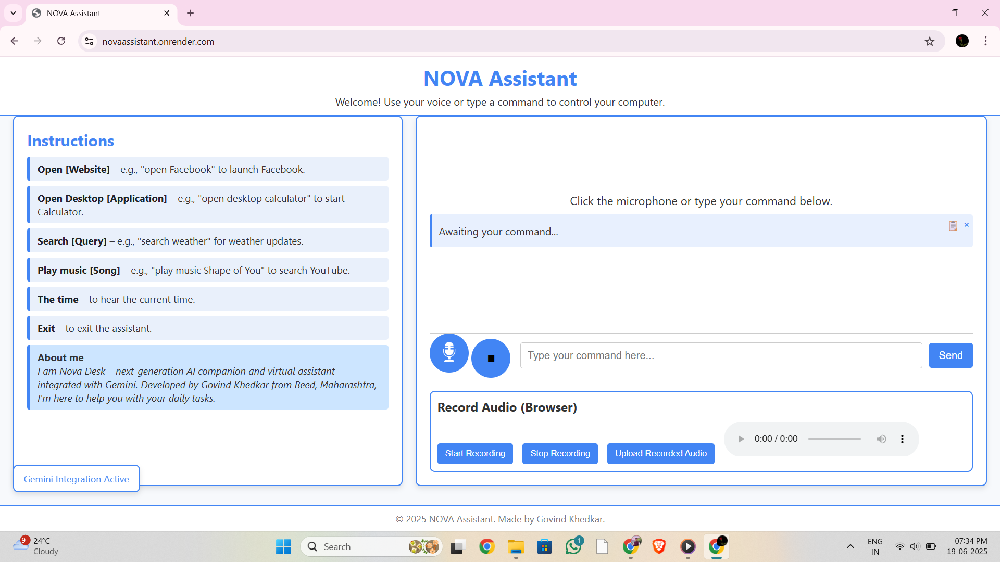

Nova Assistant
==============

Nova Assistant is a modern, Flask-based personal assistant application that integrates voice command support, Gemini API connectivity, and browser-based text-to-speech functionality. It has been designed to work seamlessly both locally (with direct microphone access) and on headless hosting environments (using browser-based audio recording).

Preview
-------

Features
--------

• Voice Commands:
  - Local: Captures audio using your system microphone with the SpeechRecognition library.
  - Remote: Uses browser-based recording to upload audio for speech-to-text processing.

• Browser-Based Text-to-Speech:
  - Utilizes the Web Speech API to provide audible responses directly in the browser.

• Gemini API Integration:
  - Processes user queries via the Gemini API (requires a valid GEMINI_API_KEY).

• Responsive Web Interface:
  - Built with Flask templates and modern CSS for an engaging user experience.

Tech Stack
----------

- Backend: Flask (Python)
- Frontend: HTML, CSS, JavaScript
- APIs: Gemini API, Web Speech API
- Voice Input: SpeechRecognition
- Hosting: Render
- Production Server: Gunicorn

Requirements
------------

- Python 3.8+
- Flask
- python-dotenv
- requests
- SpeechRecognition
- gunicorn (for production)

Installation
------------

git clone https://github.com/GovindTechie/novaAssistant.git

cd nova-assistant
pip install -r requirements.txt

Configuration
-------------

Create a .env file in the root directory and add:

GEMINI_API_KEY=your_gemini_api_key

Replace "your_gemini_api_key" with your actual Gemini API key.

Running Locally
---------------

python app.py

Then open your browser and navigate to:
http://127.0.0.1:5000

Deploying on Render
-------------------

1. Push your updated code to GitHub.
2. Log in to Render and create a new Web Service linked to your repository.
3. Configure the service:
   - Build Command: pip install -r requirements.txt
   - Start Command: gunicorn app:app --bind 0.0.0.0:5000
4. Set Environment Variables:
   Add GEMINI_API_KEY in Render’s dashboard matching your .env settings.
5. Deploy and test your service via the provided Render URL.

Live Demo: https://novaassistant.onrender.com

Usage
-----

• Local Voice Command:
  Use the "Click to speak" button to capture and process your voice input (when a microphone is available).

• Browser-Based Audio Recording:
  Record audio using the provided browser controls ("Start Recording", "Stop Recording", and "Upload Recorded Audio") for environments where direct microphone access isn’t available.

• Manual Text Commands:
  Enter your commands in the text field and click "Send" to process them.

License
-------

This project is licensed under the MIT License. Refer to the LICENSE file for details.

Acknowledgments
---------------

• Flask – for the web framework.
• SpeechRecognition – for audio capture and processing.
• Web Speech API – for browser-based text-to-speech.
• Render – for hosting the application.

Author
------

Govind Khedkar
